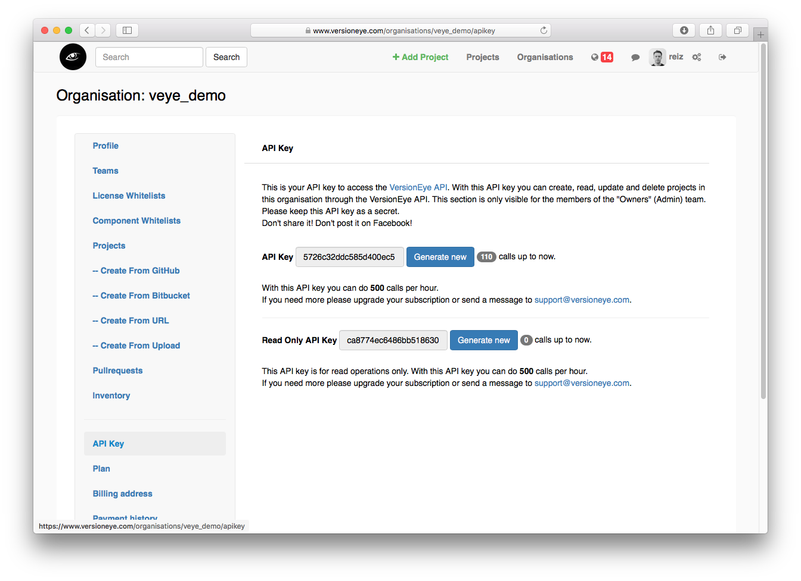
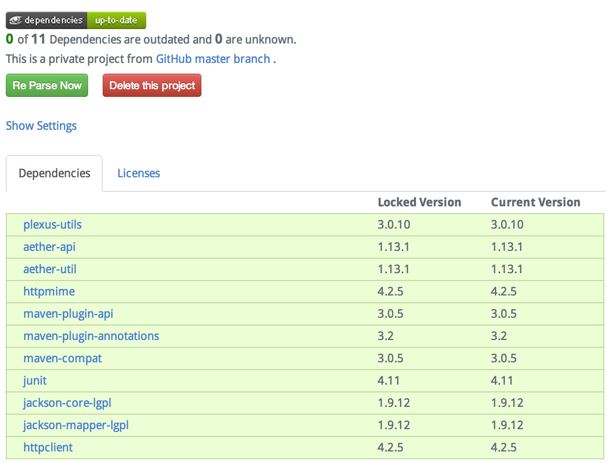
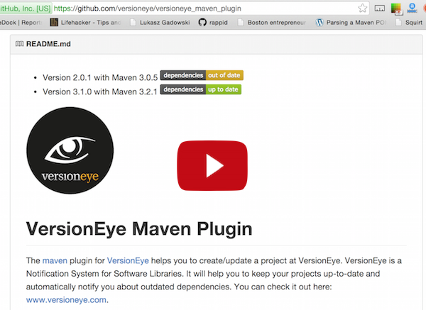

[](https://www.versioneye.com)

[](https://www.versioneye.com/user/projects/544d0ff9512592562c000003)

# VersionEye Maven Plugin

The [maven](http://maven.apache.org/) plugin for [VersionEye](http://www.versioneye.com) helps you to create/update a project at VersionEye, which is a Notification System for Software Libraries. It will help you to keep your projects up-to-date and automatically notify you about outdated dependencies and license violations. You can check it out here: [www.versioneye.com](http://www.versioneye.com).

Summary

 - [Install binary](#install-binary)
 - [Install from source](#install-from-source)
 - [Getting started](#getting-started)
 - [API Key](#api-key)
 - [mvn versioneye:create](#mvn-versioneyecreate)
 - [mvn versioneye:update](#mvn-versioneyeupdate)
 - [mvn versioneye:licenseCheck](#mvn-versioneyelicensecheck)
 - [mvn versioneye:securityCheck](#mvn-versioneyesecuritycheck)
 - [mvn versioneye:securityAndLicenseCheck](#mvn-versioneyesecurityandlicensecheck)
 - [mvn versioneye:delete](#mvn-versioneyedelete)
 - [Proxy](#proxy)
 - [VersionEye Enterprise](#versioneye-enterprise)
 - [Multi-Module Projects](#multi-module-projects)
 - [Configuration Options](#configuration-options)
 - [Feedback](#feedback)
 - [License](#license)

## Install binary

The VersionEye Maven plugin is available on the [Maven Central Repository](http://search.maven.org).
That means Maven will find it automatically, without adding any other
repositories! And you can find the project on [bintray](https://bintray.com/versioneye/versioneye/versioneye-maven-plugin/)
as well.

Switch to the project where you want to use this plugin.
You can add the plugin to your project by adding this snippet to your
`pom.xml` file.

```xml
<build>
  <plugins>
    <plugin>
      <groupId>com.versioneye</groupId>
      <artifactId>versioneye-maven-plugin</artifactId>
      <version>3.11.1</version>
    </plugin>
  </plugins>
</build>
```

The `versioneye-maven-plugin` is tested against Maven 3.3.9.
If you are using Maven 3.0.5 or older you should use the
`versioneye-maven-plugin` version 2.0.1.

Alternatively you can add `versioneye` to the plugin group search path. You do this by adding
```xml
<pluginGroups>
  <pluginGroup>com.versioneye</pluginGroup>
</pluginGroups>
```

to the user's Maven settings file (`~/.m2/settings.xml`). This will allow to use the `versioneye:*`
command line goals interactively in all projects.

## Install from source

If you wanna install the plugin from source, you have to follow this steps.

```
git clone https://github.com/versioneye/versioneye_maven_plugin.git
```

Switch to the root directory of the project:

```
cd versioneye_maven_plugin
```

And install it in your local maven repository:

```
mvn clean install
```

Now the plugin is installed on your local machine!


## Getting Started

You can check out all goals like this

```
mvn versioneye:help
```

That will output all possible goals on the versioneye plugin.

Now you can check if the [VersionEye API](https://www.versioneye.com/api?version=v2) is available:

```
mvn versioneye:ping
```

That should return an output like this:

```
{"success":true,"message":"pong"}
```

Now try this:

```
mvn versioneye:list
```

That will get you a list with all your direct and recursive dependencies and it will tell you how many dependencies you have in your project altogether.

Here you can convert your `pom.xml` to a `pom.json`

```
mvn versioneye:json
```

It will take all your direct dependencies and convert them into `/target/pom.json`. This is just for fun! You don't really need it, but I thought it's fun to write a small `pom.xml` to `pom.json` converter :-)

## API Key

This plugin can push your dependencies to the VersionEye API, create a project at VersionEye and tell you which of your dependencies are outdated. VersionEye will automatically check your project and notify you about outdated dependencies. You can use some of the resources at the VersionEye API without an *API KEY*, but for the project resource you need one. If you are [signed up](https://www.versioneye.com/signup) you can find your *API KEY* here: [https://www.versioneye.com/settings/api](https://www.versioneye.com/settings/api).



Now let the versioneye-maven-plugin know what your *API KEY* is.

```xml
<build>
  <plugins>
    <plugin>
      <groupId>com.versioneye</groupId>
      <artifactId>versioneye-maven-plugin</artifactId>
      <version>3.11.1</version>
      <configuration>
        <apiKey>MY_SECRET_API_KEY</apiKey>
      </configuration>
    </plugin>
  </plugins>
</build>
```

If you don't want to store the api key in the `pom.xml`, alternatively you can store it in a `versioneye.properties` file.

```
echo "api_key=YOUR_API_KEY" > versioneye.properties
```

If the API Key is not set directly in the pom.xml file, the versioneye-maven-plugin will try to fetch the API Key from the `versioneye.properties` file and it will look up the file in this places:

```
/src/qa/resources/versioneye.properties
```

If it can't find the file there it will look it up at this place:

```
src/main/resources/versioneye.properties
```

If you want so you can configure another place for the versioneye.properties file. Just set the path explicitly in the pom.xml on the versioneye plugin configuration:

```xml
<build>
  <plugins>
    <plugin>
      <groupId>com.versioneye</groupId>
      <artifactId>versioneye-maven-plugin</artifactId>
      <version>3.11.1</version>
      <configuration>
        <propertiesPath>${basedir}/versioneye.properties</propertiesPath>
      </configuration>
    </plugin>
  </plugins>
</build>
```

If the plugin can't find the API KEY in any of this locations it will look it up at this place:

```
~/.m2/versioneye.properties
```

That means if you don't want to commit your *API KEY* to the server and share it with your team you can place the file in your *home* directory and keep it for you. But *don't commit this file with secret*. So add it to `.gitignore` exclusions.

Of course you can store the API key in an environment variable `VERSIONEYE_API_KEY` as well. 

```
export VERSIONEYE_API_KEY=my_secret_api_key
```

That's a good way to deal with the API key on an CI system. 

## mvn versioneye:create

If your *API KEY* is in place you can create a new project at VersionEye based on the dependencies in your `pom.xml` file with this goal:

```
mvn versioneye:create
```

This command will **not** change your local project. It just sends your dependencies to the VersionEye server and creates, based on that, a new project at [www.versioneye.com](http://www.versioneye.com). If everything went right you will see in the output the URL to your new created VersionEye project. Just copy and paste it into you browser to check it out. Here is an example how it could look like:



Besides that, the plugin will add a `project_id` to the `versioneye.properties` file. The `project_id` is the connection between your `pom.xml` and the VersionEye project. If the `versioneye.properties` file doesn't exist yet, it will be created now.

If you don't want that the versioneye maven plugin creates/updates the `versioneye.properties` file you can skip that step with this line in the plugin configuration:

```xml
<updatePropertiesAfterCreate>false</updatePropertiesAfterCreate>
```

If you do so, you have to add the `project_id` by hand to the plugin configuration for the next step, the `versioneye:update` goal.

## mvn versioneye:update

After you created a new project on VersionEye you can update it with the dependencies from the `pom.xml` file with this goal:

```
mvn versioneye:update
```

That will simply update the existing VersionEye project with the dependencies from your `pom.xml` file. It will **not** change your `pom.xml`. This goal usually gets executed on a Continuous Integration server after each build.

By the way. If you don't like to have a `versioneye.properties` file you can set the `project_id` explicitly in the `pom.xml`. Just like this:

```xml
<build>
  <plugins>
    <plugin>
      <groupId>com.versioneye</groupId>
      <artifactId>versioneye-maven-plugin</artifactId>
      <version>3.11.1</version>
      <configuration>
        <projectId>_YOUR_VERSONEYE_PROJECT_ID_</projectId>
      </configuration>
    </plugin>
  </plugins>
</build>
```

## mvn versioneye:licenseCheck

On VersionEye you can have [License Whitelists](http://blog.versioneye.com/2014/09/15/license-whitelist/). If you
are working with License Whitelists you probably want to break the build if there is a license violation.
The next goal will update your VersionEye project with the current dependencies and check them against a
License Whitelist. If there is a violation of the License Whitelist this goal will break your build:

```
mvn versioneye:licenseCheck
```

## mvn versioneye:securityCheck

This goald will check if your dependencies have known security vulnerabilities:

```
mvn versioneye:securityCheck
```

If one of project dependencies has a known security vulnerability this goal will break your build!

## mvn versioneye:securityAndLicenseCheck

This goald will check if your dependencies have known security vulnerabilities or if they violate the license whitelist on the server:

```
mvn versioneye:securityAndLicenseCheck
```

If one of the 2 is violated this goal will break your build!

## mvn versioneye:delete

This goal will delete the project from the VersionEye server:

```
mvn versioneye:delete
```

This golad will also remove all related `versioneye.properties` files!

## Proxy

If you are behind a proxy server you can configure the plugin for that like this.

```xml
<build>
  <plugins>
    <plugin>
      <groupId>com.versioneye</groupId>
      <artifactId>versioneye-maven-plugin</artifactId>
      <version>3.11.1</version>
      <configuration>
        <proxyHost>127.0.0.1</proxyHost>
        <proxyPort>8888</proxyPort>
        <proxyUser>proxy_hopsi</proxyUser>
        <proxyPassword>dont_tell_anybody</proxyPassword>
      </configuration>
    </plugin>
  </plugins>
</build>
```

## VersionEye Enterprise

If you are using the VersionEye Enterprise VM in your own private network you probably want to use this plugin against the VersionEye Enterprise API. In that case you can change the baseUrl with this line:


```xml
<baseUrl>http://versioneye.my-company.com</baseUrl>
```
The whole plugin snippet would look similar to this one.

```xml
<build>
  <plugins>
    <plugin>
      <groupId>com.versioneye</groupId>
      <artifactId>versioneye-maven-plugin</artifactId>
      <version>3.11.1</version>
      <configuration>
        <baseUrl>http://versioneye.my-company.com</baseUrl>
        <projectId>_YOUR_VERSONEYE_PROJECT_ID_</projectId>
      </configuration>
    </plugin>
  </plugins>
</build>
```

## Multi-Module Projects

Assume you have a big Java Enterprise multi-module project with Maven and you want to have all modules monitored by VersionEye. I further assume that all modules have the same parent pom and the modules are listed in the parent pom.xml file. In that case all you have to do is configuring the VersionEye Maven Plugin once in the parent pom.

```xml
<build>
  <plugins>
    <plugin>
      <groupId>com.versioneye</groupId>
      <artifactId>versioneye-maven-plugin</artifactId>
      <version>3.11.1</version>
      <configuration>
        <apiKey>MY_SECRET_API_KEY</apiKey>
      </configuration>
    </plugin>
  </plugins>
</build>
```

Now run this command in the parent directory:

```
mvn versioneye:create
```

This command will be executed on each module. The plugin will create for each module a new project on VersionEye. Beside that the plugin will create for each module a `versioneye.properties` file with the corresponding project_id. The file will be created/updated in the `src/main/resources` directory of each module.

After the projects are created on VersionEye we don't need the `create` goal anymore. Now we can perform the `update` goal on each build.

```
mvn versioneye:update
```

This will update the project on VersionEye with the current dependencies in the modules pom.xml file. Executing this command in the parent pom directory will update all modules. Ideally this goal is executed on the Continuous Integration System after each build.

Here is a YouTube video which demonstrates how to setup a multi-module project with the VersionEye Maven Plugin.

[](http://www.youtube.com/watch?v=JPVEuqGHbeU)

## Configuration Options

The VersionEye Maven Plugin has many configuration options.

```xml
      <plugin>
        <groupId>com.versioneye</groupId>
        <artifactId>versioneye-maven-plugin</artifactId>
        <version>3.11.1</version>
        <configuration>
          <projectId>544d0ff9512592562c000003</projectId>
          <!--<apiKey>my_secret_api_key</apiKey>-->
          <!--<baseUrl>http://localhost:3000</baseUrl>-->
          <!--<proxyHost>127.0.0.1</proxyHost>-->
          <!--<proxyPort>8888</proxyPort>-->
          <!--<proxyUser>proxy_hopsi</proxyUser>-->
          <!--<proxyPassword>dont_tell_anybody</proxyPassword>-->
          <!--<updatePropertiesAfterCreate>false</updatePropertiesAfterCreate>-->
          <!--<mergeAfterCreate>false</mergeAfterCreate>-->
          <!--<parentGroupId>com.versioneye</parentGroupId>-->
          <!--<parentArtifactId>versioneye-maven-plugin</parentArtifactId>-->
          <!--<nameStrategy>name</nameStrategy>-->
          <!--<trackPlugins>true</trackPlugins>-->
          <!--<licenseCheckBreakByUnknown>true</licenseCheckBreakByUnknown>-->
          <!--<skipScopes>test,provided</skipScopes>-->
          <!--<organisation>versioneye</organisation>-->
          <!--<team>backend_devs</team>-->
          <!--<name>NameOfTheProjectAtVersionEye</name>-->
          <!--<visibility>public</visibility>-->
          <!--<ignoreDependencyManagement>false</ignoreDependencyManagement>-->
          <!--<transitiveDependencies>false</transitiveDependencies>-->
        </configuration>
      </plugin>
```
Here is a more detailed documentation of the configuration options.

Config option | Description
------------- | -----------
apiKey        | Your secret API Key for the VersionEye API. Get it here: [https://www.versioneye.com/settings/api](https://www.versioneye.com/settings/api)
baseUrl       | Set the base URL for the VersionEye API. Only needed for VersionEye Enterprise!
proxyHost     | Set your proxy host name or IP.
proxyPort     | Set your proxy port here.
proxyUser     | Set you proxy user name here.
proxyPassword | Set your proxy password here.
updatePropertiesAfterCreate | This is related to this [issue](https://github.com/versioneye/versioneye_maven_plugin/issues/34)
mergeAfterCreate | If the plugin is executed on a multi module project, the plugin will merge all submodules into the parent project by default. If this behaviour is not desired it can be switched off with this configuraiton option!
parentGroupId | If the plugin is executed on a multi module project, the plugin will merge all submodules into the parent project on the server. the parent project is determined from the pom.xml. However it is possible to set the group_id of the parent project exeplicitly! That way the submodules can be merged into any other Java project at VersionEye.
parentArtifactId | If the plugin is executed on a multi module project, the plugin will merge all submodules into the parent project on the server. the parent project is determined from the pom.xml. However it is possible to set the artifact_id of the parent project exeplicitly! That way the submodules can be merged into any other Java project at VersionEye.
nameStrategy  | If a new project is created the plugin will take the `name` attribute from the pom.xml as the name of the project at VersionEye. Other naming strategies are possible <ul><li><b>GA</b>: Takes "GroupID / ArtifactID" as name</li><li><b>artifact_id</b>: Takes the "ArtifactID" as name</li></ul> The project name can be changed on the server afterwards and is not needed to identify a project!
trackPlugins  | By default the plugins who are defined in the pom.xml file are handled like regular dependencies with the "plugin" scope. Plugins can be ignored by setting this property to "false".
licenseCheckBreakByUnknown | If this is true then the goal "versioneye:licenseCheck" will break the build if there is a component without any license.
skipScopes    | Comma seperated list of scopes which should be ignored by this plugin.
organisation  | The name of an organisation at VersionEye. If this is set the project will be assigend to that organisation!
team          | The name of the team inside the organisation at VersionEye. If this is set the project will be assigend to that team! The team which is defined here has to exist in the organisation which is defined here!
name          | With this property you can set explicitly the name of the VersionEye project.
visibility    | 'public' of 'private'. Controls if the project on VersionEye will be public or private.
propertiesPath | The path to the versioneye.properties file. By default it is "/src/main/resources/"
ignoreDependencyManagement | If this attribute is true the dependencies from "DependencyManagement" are ignored. By default it is false!
transitiveDependencies | Resolve and send transitive dependencies to the VersionEye API. In this mode the properties `ignoreDependencyManagement` and `skipScopes` does not work.


## Feedback

For bugs and feature requests please use the [ticket system](https://github.com/versioneye/versioneye_maven_plugin/issues). Pull Requests are welcome ;-)

## Support

For commercial support send a message to `support@versioneye.com`.

## License

VersionEye-Core is licensed under the MIT license!

Copyright (c) 2016 VersionEye GmbH

Permission is hereby granted, free of charge, to any person obtaining a copy
of this software and associated documentation files (the "Software"), to deal
in the Software without restriction, including without limitation the rights
to use, copy, modify, merge, publish, distribute, sublicense, and/or sell
copies of the Software, and to permit persons to whom the Software is
furnished to do so, subject to the following conditions:

The above copyright notice and this permission notice shall be included in all
copies or substantial portions of the Software.

THE SOFTWARE IS PROVIDED "AS IS", WITHOUT WARRANTY OF ANY KIND, EXPRESS OR
IMPLIED, INCLUDING BUT NOT LIMITED TO THE WARRANTIES OF MERCHANTABILITY,
FITNESS FOR A PARTICULAR PURPOSE AND NONINFRINGEMENT. IN NO EVENT SHALL THE
AUTHORS OR COPYRIGHT HOLDERS BE LIABLE FOR ANY CLAIM, DAMAGES OR OTHER
LIABILITY, WHETHER IN AN ACTION OF CONTRACT, TORT OR OTHERWISE, ARISING FROM,
OUT OF OR IN CONNECTION WITH THE SOFTWARE OR THE USE OR OTHER DEALINGS IN THE
SOFTWARE.
